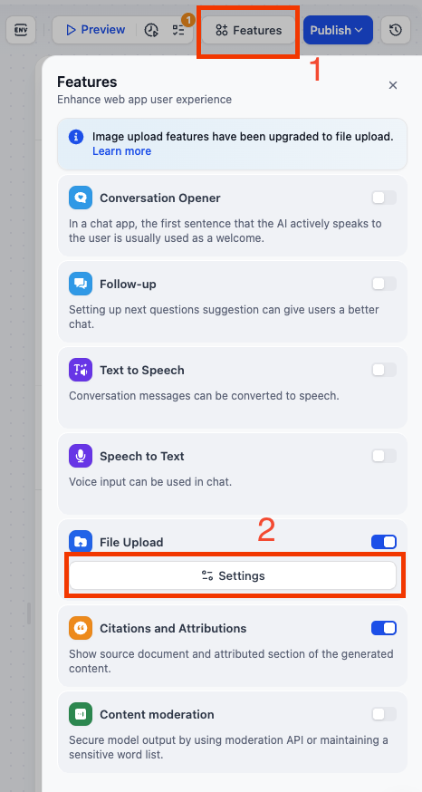
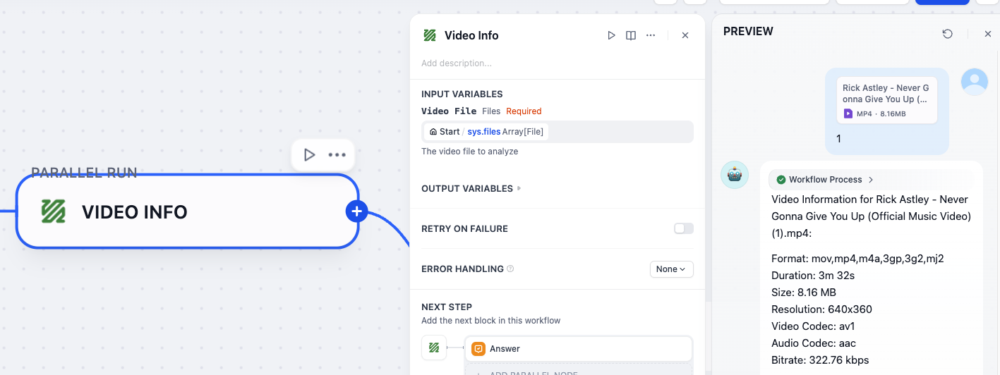
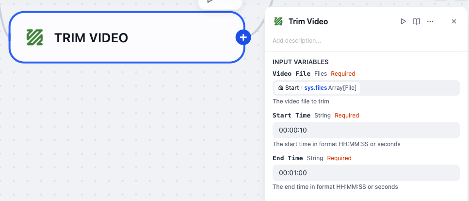
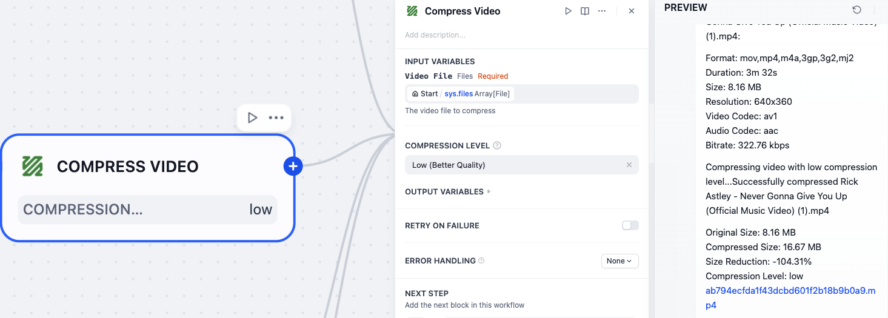
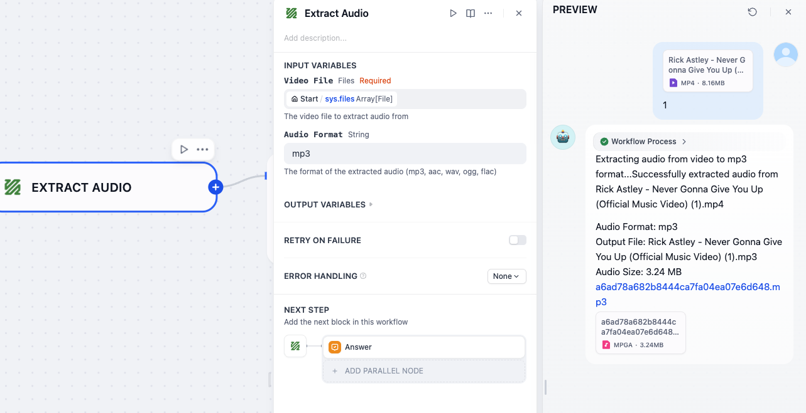

# FFmpeg Plugin for Dify

**Author:** [stvlynn](https://github.com/stvlynn)
**Version:** 0.0.1
**Type:** tool

## Description

FFmpeg plugin for Dify, enabling video and audio file processing and conversion. The plugin provides tools for retrieving video information, format conversion, trimming, compression, and audio extraction.

## Requirements

- FFmpeg must be installed on the system
- Python 3.12+
- **You must enable video file upload in Dify's Features > File Upload settings.**

  1. Go to the **Features** tab in your Dify app and enable **File Upload**:

     

  2. In the File Upload settings, make sure to check the **Video** file type :

     


## Features

The plugin provides the following capabilities:

### 1. Video Information



Gets detailed technical information about a video file, including format, duration, resolution, codecs, and other metadata.

### 2. Video Conversion


Converts video files from one format to another, supporting common formats like MP4, AVI, MOV, MKV, and more.

### 3. Video Trimming



Extracts a specific section of a video by specifying start and end times, maintaining the original quality.

### 4. Video Compression



Compresses a video file to reduce its size while attempting to maintain reasonable quality. Useful for sharing videos or saving storage space.

### 5. Audio Extraction



Extracts the audio track from a video file and saves it as an audio file in various formats.


## Parameters

### Video Information Parameters

| Parameter | Type | Required | Description |
|-----------|------|----------|-------------|
| video | file | Yes | The video file to analyze |

### Video Conversion Parameters

| Parameter | Type | Required | Description |
|-----------|------|----------|-------------|
| video | file | Yes | The video file to convert |
| target_format | string | Yes | The format to convert the video to (mp4, avi, mov, mkv, etc.) |

### Video Trimming Parameters

| Parameter | Type | Required | Description |
|-----------|------|----------|-------------|
| video | file | Yes | The video file to trim |
| start_time | string | Yes | The start time (format: HH:MM:SS or seconds) |
| end_time | string | Yes | The end time (format: HH:MM:SS or seconds) |

### Video Compression Parameters

| Parameter | Type | Required | Description |
|-----------|------|----------|-------------|
| video | file | Yes | The video file to compress |
| compression_level | select | No | Compression level: low, medium, high (default: medium) |

### Audio Extraction Parameters

| Parameter | Type | Required | Description |
|-----------|------|----------|-------------|
| video | file | Yes | The video file to extract audio from |
| audio_format | string | No | Format of extracted audio (mp3, aac, wav, ogg, flac) (default: mp3) |

## Usage Examples

### Get Video Information Example

```json
{
    "video": [uploaded_video_file]
}
```

### Convert Video Example

```json
{
    "video": [uploaded_video_file],
    "target_format": "mp4"
}
```

### Trim Video Example

```json
{
    "video": [uploaded_video_file],
    "start_time": "00:01:30",
    "end_time": "00:02:45"
}
```

### Compress Video Example

```json
{
    "video": [uploaded_video_file],
    "compression_level": "medium"
}
```

### Extract Audio Example

```json
{
    "video": [uploaded_video_file],
    "audio_format": "mp3"
}
```

## Security Considerations

- Ensure you have the necessary rights to process and convert the media files
- The plugin uses temporary files which are automatically cleaned up after processing

## License

[MIT](./LICENSE)

## Feedback and Issues

If you encounter any problems or have suggestions for improvements:

1. Please open an issue in the [plugin's GitHub repository](https://github.com/stvlynn/ffmpeg-Dify-Plugin/issues)

2. Provide details about your problem, including error messages and steps to reproduce

3. **Do not** submit issues to the main [Dify](https://github.com/langgenius/dify) repository for plugin-specific problems


